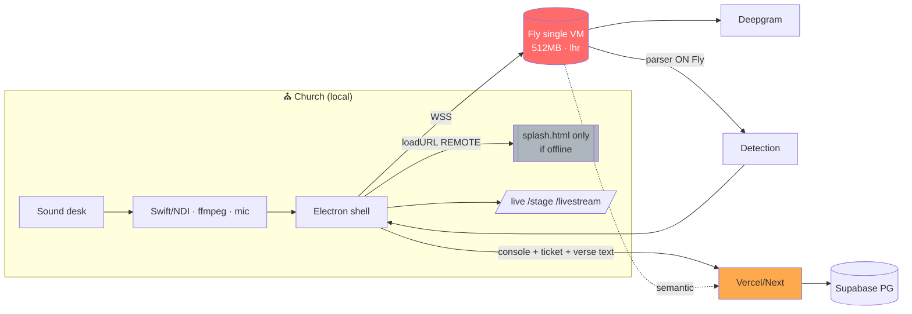
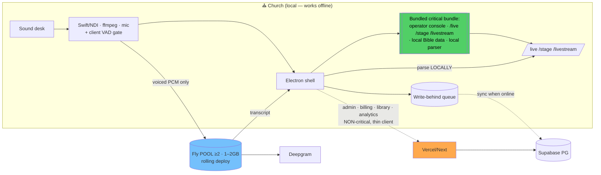

# PresentFlow — Architecture Review & Scaling Plan

_Planning document · 2026-08-17 · reviewed against `CLAUDE.md`, `package.json`, `scripts/audio-server.ts`, `fly.toml`, `electron/main.ts`, `src/app/*`, `src/lib/actions.ts`, `src/lib/db/schema.ts`, `src/lib/bible-parser.ts`. **No code written — decisions in §5 need sign-off before implementation.**_

Critical path on Sunday: church sound desk → local capture (Swift/NDI · ffmpeg · browser mic) → operator Electron console → WebSocket → Fly → Deepgram → **parser (on Fly)** → detection back to operator → operator approves → `pf:live` IPC relay → `/live` `/stage` `/livestream`.

---

## 0. CONFIRMED FACTS (updated 2026-08-17, from live dashboards) + NORTH STAR

**Deepgram** — Plan: **Pay As You Go**, credit **$131.06**, model nova-3, project `6caa89b9…`. PAYG is self-serve; its **concurrent-stream ceiling** (the real Sunday constraint) is not shown on the dashboard — **must pull from the limits/billing page** (§5.9). At ~$0.0077/min nova streaming, a 2h service ≈ $0.92; $131 ≈ ~140 service-hours (~3–4 months at 10 churches). Cost scales linearly with usage → revenue-aligned.

**Fly** — App `faithflow-audio`, **already 2 machines** in **LHR**, both `shared-1x@512MB`, process group `app`, release v40, 2/100 machines used. So machine-level redundancy **already exists**; the SPOF is now narrower: **512MB headroom, single region, and deploy/restart behaviour**, not machine count.

### What this means for the plan
- **A1 is essentially already done** (2 machines). Remaining Fly work is *vertical* (512MB→1–2GB for headroom under Deepgram sockets + 480KB rings + interim JSON) and *deploy safety* (rolling, one machine at a time so half the churches never drop together), then *regions* only when churches spread beyond the UK/EU.
- **Deepgram PAYG is fine to ~10–20 concurrent** on any reasonable self-serve ceiling; the upgrade to **Growth/Enterprise** is a §C item triggered by *concurrent* (not total) church count — i.e. how many services run at the same 10am slot.
- **Not Apple-enrolled yet** → signing/notarization (A2) is a clean, do-now action ($99/yr).

### North Star (the durable target — what "strong for the long term" means here)
1. **Offline-first critical path.** The operator console + 3 output routes + Bible + parser run **locally in Electron** and a full service can be run start-to-finish with the internet unplugged. Everything non-critical (admin, billing, library mgmt, analytics) stays a remote thin client for instant updates. _This is the single biggest long-term-strength move and the main competitive gap vs ProPresenter._
2. **Parser lives with the client, not the bridge.** Pure already → runs client-side; parser updates ship via Vercel; a parser bug can never crash the audio bridge.
3. **Audio tier is a horizontally-scalable pool** (2+ machines, 1–2GB, rolling deploys, regions added by geography) with **client-side VAD** so only voiced audio is streamed (cuts Deepgram cost + silence-churn).
4. **Every external dependency degrades gracefully with an explicit operator signal** — Deepgram down → MANUAL MODE banner; offline → local mode; Supabase down → local Bible + write-behind queue.
5. **Signed/notarized auto-updating desktop app** so non-technical volunteers install in one double-click and updates land automatically.
6. **Deploy discipline** — staging-church smoke test + weekend freeze; betas pinned.

Reaching all six = a backend that is healthy, offline-resilient, cost-scales-with-revenue, and ready to push church count hard. The rest of this document is the audit + the sequenced path to that north star.

---

## 1. AUDIT: Critical Path Failure Analysis

| Component | Failure mode | Blast radius | Current mitigation | Needed mitigation |
|---|---|---|---|---|
| **Church internet uplink** | Drops mid-service | **Total** — WS to Fly dead, operator console (remote Vercel) can't load/reload, verse-text lookups fail | `loadWithRecovery()` shows branded splash + infinite backoff reconnect (`main.ts:405-431`). Degrades to *nothing usable*. | Local operator bundle + local Bible data + manual mode that works with zero network |
| **Fly audio VM** (single `shared-1x`/512MB, `min=1`, `auto_stop=off`, no `max`, 1 region `lhr`, `fly.toml:21-40`) | Deploy / restart / OOM / Fly host maintenance | **ALL churches lose AI detection simultaneously**; every live WS drops at once | `min_machines_running=1`, `auto_start=true`, TCP health check, SIGTERM/10s; clients reconnect with backoff | ≥2 machines + rolling deploy so a restart never drops everyone; size up to 1–2GB |
| **Vercel** (operator console + `/api/audio/ticket` + `/api/bible/lookup` + `/api/internal/semantic-search`) | Outage / bad deploy | **Total for new sessions** — can't load console, can't mint audio ticket (so can't even *start* audio), can't fetch verse text | None (thin client) | Bundle critical path locally in Electron; local verse data; local/queued ticket path |
| **Deepgram** | Outage / quota exceeded | All transcription + detection stops | Fails open — operator can still drive manually *if the console is already loaded*; 429 circuit breaker on Whisper | Explicit "AI down → MANUAL MODE" banner; console must stay 100% usable without AI |
| **Supabase Postgres** | Outage / slowness | Verse lookups fail, plan/song data unavailable, transcript/detection writes fail; hot-path `transcriptSegments` insert is **awaited** (FK dependency, `audio-server.ts:939`) | None documented | Local Bible cache, local plan snapshot, write-behind queue |
| **Groq** (Whisper 2-pass + AI helpers) | Outage / 429 | Whisper double-check + AI features degrade; **core rule-parser detection unaffected** | Graceful — fails open, 429 → 30s cooldown (`audio-server.ts:1086`) | None critical (this is the model to emulate elsewhere) |
| **Fly 512MB memory** | Pressure at scale | OOM kills **all** connections on the machine | 64KB frame cap, bounded maps, 480KB/conn canonical ring | Vertical bump + horizontal spread before rings + Deepgram sockets + interim JSON parsing saturate |
| **Audio ticket (Vercel-minted)** | Vercel down | Cannot **start** any new audio session even if Fly + Deepgram are healthy | None | Local/offline ticket path once critical bundle is local |
| **Bleeding-edge deps** (Next 15, React 19, Tailwind 4 beta, NextAuth v5 beta, Electron 43) | Breaking change ships | Potential Sunday breakage | None documented | Staging-church smoke test + weekend deploy freeze |

### External dependencies & failure posture
- **Deepgram** — one streaming connection **per church connection** (`openDeepgram`), lazy-reopen on stall, KeepAlive every 4s through silence. Correct design; the ceiling is the plan's **concurrent-connection quota** (unverified — blocking item, §5.9).
- **Groq** — best-effort, gated, circuit-broken. Reference model for graceful degradation.
- **Supabase / API.Bible** — verse text only exists in Postgres (public-domain) or API.Bible (licensed). No local copy.

### Unnecessary network-boundary crossings
1. **Parser runs on Fly but is 100% pure** (`bible-parser.ts` — no `fetch`/`db`/`fs`/`env`, 1188 lines, only imports pure data). Today: Deepgram → Fly → parse → detection → client. It **could** be Deepgram → Fly → transcript → client → parse-locally. That removes the parser from the bridge (parser updates ship via Vercel instantly instead of a Fly redeploy), and a parser bug can no longer crash the audio bridge mid-service. Directly resolves known-weakness #5. **Caveat:** server-side dedup / `forceLive` / repeat-occurrence / `lastActiveRef` state (`audio-server.ts:711-748, 1008-1030`) must move with it.
2. **Semantic search** already correctly moved off Fly to Vercel — but Fly still makes a cross-service HTTP hop per low-confidence detection.
3. **Verse text** fetched Vercel → Supabase per chapter (cached in-session). Fine online, fatal offline.

### Scalability bottlenecks
- **10 churches:** single 512MB/1-shared-CPU is the risk, not throughput per se — it's a *correlated* failure domain. Whisper 2-pass concurrency + per-conn 480KB rings + interim JSON parsing (~5–15 msg/s × 10) are survivable but leave no headroom. **Verify Deepgram concurrency.**
- **50 churches:** 512MB/1CPU insufficient — 50 Deepgram sockets, ~24MB of rings, 50 parser passes, 250–750 interim msgs/s to JSON-parse. Needs a pool + probably multi-region.
- **100 churches:** multi-region (churches aren't all UK), sharded/pooled with connection-aware balancing, Deepgram enterprise concurrency, shared coordination store if per-machine caps matter.

---

## 2. ARCHITECTURE: Hybrid Design Recommendation

### Current (thin client — everything critical is remote)

Everything red/orange is a hard dependency on the church's internet + a remote service *during the live service*.

### Target (progressive-bundling hybrid — critical path local, rest remote)

Green = survives an internet drop. Only transcription (Deepgram, inherently a cloud ASR) and non-critical admin remain remote.

### Decision matrix — the 4 options

| Option | Offline coverage | Effort | Fit to this codebase | Reliability | Verdict |
|---|---|---|---|---|---|
| **1. Service Worker + Cache API** | Console shell only; **not** data/verse text | Low–Med | **Poor** — SW is deliberately kill-switched (`public/sw.js` unregisters + purges; `ServiceWorkerRegister.tsx`); caching an App-Router SSR/RSC app offline is fragile; server actions still need network | Medium | ❌ Reject as primary |
| **2. Electron full local bundle + remote sync** | Full | **High** | Partial — desktop-first matches strategy, but they *explicitly removed* the local Next server (`main.ts:92,565-568`); every server-action path needs a local runtime | Highest | ⚠️ More than needed now |
| **3. Local-first CRDT (Yjs/Automerge)** | Full | **Very High** | **Overkill** — one operator drives one service; there's no concurrent multi-writer conflict for a CRDT to solve | High | ❌ Reject |
| **4. Progressive bundling (critical local, rest remote)** | **Critical live path** | Med–High | **Best** — leverages the pure parser, the local `pf:live` relay, same-machine BroadcastChannel; keeps thin-client updates for admin | High on the path that matters | ✅ **Recommend** |

### Recommendation: **Option 4**, a pragmatic blend leaning on what already exists

Bundle **only** the Sunday-morning critical path into the Electron app — operator console (`/services/[id]/operate`), the three output routes (`/live`, `/stage`, `/livestream`), Bible lookup backed by a **local public-domain verse dataset**, and the **client-side parser** — so a service survives an internet drop. Keep everything else (admin, billing, library management, onboarding, analytics under `(app)/settings`, `(app)/organization`, `(app)/library`) as the remote Vercel thin client for instant updates.

Why this over the others: it fits the invariants already in place — `pf:live` is already a local main-process relay; BroadcastChannel is already the primary same-machine sync (rule 8); the parser is already pure. The real work is a **local data layer for the critical path** (bundled Bible + plan snapshot + write-behind queue) and **serving the critical routes locally** in Electron. SW-caching (1) fights a deliberately-disabled subsystem and an SSR app; full-bundle (2) reverses an intentional architecture decision for more than the moment needs; CRDT (3) solves a problem PresentFlow doesn't have.

---

## 3. AUDIO PIPELINE: Scaling Design

### Per-church machine vs pooled
- **Per-church Fly machine** — strongest isolation (one church's OOM can't touch another), but real orchestration burden for a solo founder: routing by `churchId`, `auto_start` cold-start latency exactly at 10am, N × idle machines. Premature at 10 churches.
- **Pooled, horizontally scaled** — N machines behind Fly's connection balancing, each handling M churches; scale N with concurrent-church count. In-memory per-user caps/rate-limits become per-machine (acceptable — they're connection-abuse guards, not correctness). **Recommended.**

**Recommendation: pooled, vertical-first then horizontal.** Immediately go to **2 machines** (kills the single-point-of-failure) and size **512MB → 1–2GB** before adding many machines. Revisit per-church isolation only at 50+ if noisy-neighbor OOM actually shows up in data.

### Deepgram connection management
Current design is right: one streaming connection per church, lazy-reopen on stall, KeepAlive every 4s through silence, 30s stall watchdog keyed on *voiced* audio. Keep it. The scaling gate is the **plan's concurrent-connection quota** — 100 churches = 100 simultaneous streams at 10am. **Must verify the tier and negotiate committed-use/enterprise before Phase C.**

### Cost model (order-of-magnitude — verify against actual contracts)

| Scale | Deepgram (nova-3 streaming, ~2h/service, ~$0.0077/min PAYG) | Fly compute | Character |
|---|---|---|---|
| 10 churches | ~$50–100/mo | ~$10–15/mo (2×1GB) | Deepgram dominates |
| 50 churches | ~$185–500/mo | ~$30–60/mo | Linear, revenue-aligned |
| 100 churches | ~$370–1000/mo | ~$60–120/mo | Negotiate committed Deepgram pricing |

**The cost structure is healthy for a solo founder:** the dominant cost (Deepgram) scales linearly with usage and is covered by per-church pricing; Fly is negligible. Groq Whisper 2-pass is gated/marginal.

### Client-side audio processing
- **Move VAD / silence-gating client-side** (Web Audio API — or reuse the Swift helper's existing voiced-audio probe) so silence PCM isn't streamed during prayers/communion. Cuts Deepgram *minutes* (cost), Fly bandwidth/CPU, and the silence-driven stall churn. High ROI, low risk. **Recommend.**
- **Keep Deepgram server-side** — keys, server keyterms, no browser-SDK parity. Do not move ASR to the client.
- **Run the parser client-side** (see §1 / §2) — transcript returns, parse locally.

### Reconnection / failover if a WS drops mid-sermon
- Today: client reconnects with backoff; `min=1` + `auto_start`; lazy-reopen forwards the buffered chunk. Works, but the single machine means a Fly deploy drops *everyone* at once.
- Gaps to close: (a) **≥2 machines + rolling deploy** so restarts never drop all; (b) **short client-side audio ring buffer** so the reconnect gap doesn't lose the leading edge of speech; (c) **operator connection-health indicator** (weakness #4) — connected / reconnecting / manual-mode pill.

---

## 4. MIGRATION ROADMAP

Effort in **days** (solo founder). Each item: change · effort · deps · risk.

### Phase A — Pre-launch (before church #5): "never embarrass yourself on Sunday"
| # | Change | Effort | Deps | Risk |
|---|---|---|---|---|
| A1 | **~~Fly to 2 machines~~ (DONE — 2×512MB LHR live)** → remaining: bump 512MB→1–2GB for headroom + confirm rolling deploy (one machine at a time) | 0.5–1d | A5 (verify DG quota) | Per-user cap/rate-limit are per-machine (acceptable) |
| A2 | **Sign + notarize the macOS build** — removes `xattr -cr`, unblocks non-technical volunteers, **re-enables auto-updater** (gated on signature, `main.ts:733-748`) | 2–3d + enrollment wait | Apple Developer Program ($99/yr) | Notarization/CI setup friction |
| A3 | **Connection-health UI + graceful-degradation banners** (weakness #4, #7) — AI connected/reconnecting/**manual mode**; explicit "Deepgram down" / "offline" states | 2–3d | — | Low |
| A4 | **Client-side VAD gating** — stop streaming silence (cost + stall-churn win) | 1–2d | — | Low (Swift probe exists) |
| A5 | **Verify Deepgram plan concurrency + pricing; add Fly/Deepgram alerting** | 0.5d | — | Blocking data for A1 |

### Phase B — Growth (churches 5–20): offline resilience + decouple parser
| # | Change | Effort | Deps | Risk |
|---|---|---|---|---|
| B1 | **Decouple parser from the audio server** — parse client-side (or a separate lightweight service); parser then ships via Vercel and can't crash the bridge (resolves #5) | 3–5d | — | Must relocate server-side dedup/`forceLive`/repeat/`lastActiveRef` state |
| B2 | **Progressive bundling (Option 4)** — bundle operator console + 3 outputs + Bible into Electron; local public-domain verse dataset; local plan snapshot; keep admin/billing/library remote | 10–20d | A2, local data layer | Biggest change; server-action paths need a local-first story; large test matrix |
| B3 | **Offline write-behind queue** — detections/transcripts/plan edits queue offline, sync on reconnect | 3–5d | B2 | Conflict/idempotency care |
| B4 | **Audio reconnect buffering** — short client ring so a mid-sermon drop doesn't lose speech | 1–2d | — | Low |

### Phase C — Scale (20–100): architect when needed, not before
| # | Change | Effort | Deps | Risk |
|---|---|---|---|---|
| C1 | **Multi-region Fly pool** + region-aware routing (churches beyond UK) | 3–5d | when geography demands | Latency/routing correctness |
| C2 | **Shared coordination store** (Redis/Upstash) for cross-machine caps/dedup — only if pooling makes per-machine state a real problem | 3–5d | — | Added infra to run |
| C3 | **Deepgram enterprise concurrency + committed pricing** (ops, not eng) | — | C-scale volume | Contract |
| C4 | **Per-church / sharded isolation** — only if noisy-neighbor OOM shows in data | 5–10d | data | Don't build speculatively |
| C5 | **Dependency-stability policy** — pin bleeding-edge (Next/React/Tailwind/NextAuth betas), staging-church smoke test + weekend deploy freeze (weakness #6) | 1–2d + ongoing | — | Process discipline |

---

## 5. DECISION LOG (need your sign-off before any implementation)

1. **Hybrid approach** — Confirm **Option 4 (progressive bundling via Electron)** over SW-caching or full-local-bundle? · _Recommend: yes, Option 4._
2. **Parser location** — Move parsing **client-side (Electron)** vs a separate microservice? · _Recommend: client-side — it's already pure, ships via Vercel, decouples from the bridge, removes a hop. Caveat: server-side dedup/forceLive/repeat state must move with it._
3. **Fly scaling shape** — **Pooled** (start 2×1GB) vs per-church machines? · _Recommend: pooled; revisit isolation at 50+._
4. **Vertical-first** — Bump machine to **1–2GB before** adding many machines? · _Recommend: yes._
5. **macOS signing** — Enroll in the **Apple Developer Program now** ($99/yr, ~24–48h approval); it's the top adoption blocker and gates auto-update. · _Recommend: do it immediately._
6. **Offline verse data** — Bundle **public-domain** translations locally (~31k verses each: KJV/ASV/YLT/DARBY/…); keep **licensed** (NIV/NKJV/NLT via API.Bible) online-only with a graceful "needs internet" note? · _Recommend: yes._
7. **Client-side VAD** — Gate streaming on voiced audio to cut Deepgram cost + silence-churn? · _Recommend: yes._
8. **Deploy discipline** — **No prod deploys Sat/Sun**; staging-church smoke test before merge? · _Recommend: yes._
9. **Blocking verification before A1** — What is the current **Deepgram plan's concurrent-connection limit and pricing tier**? · _Need this number to size the pool and the cost model._

### Honest unknowns (I could not verify from the repo)
- Deepgram plan tier / concurrency quota / committed pricing (contract-side).
- Whether you're already enrolled in the Apple Developer Program.
- Exact Fly bill (depends on machine-hours once pooled).
- Real per-service audio duration + midweek service frequency (drives the cost model).
